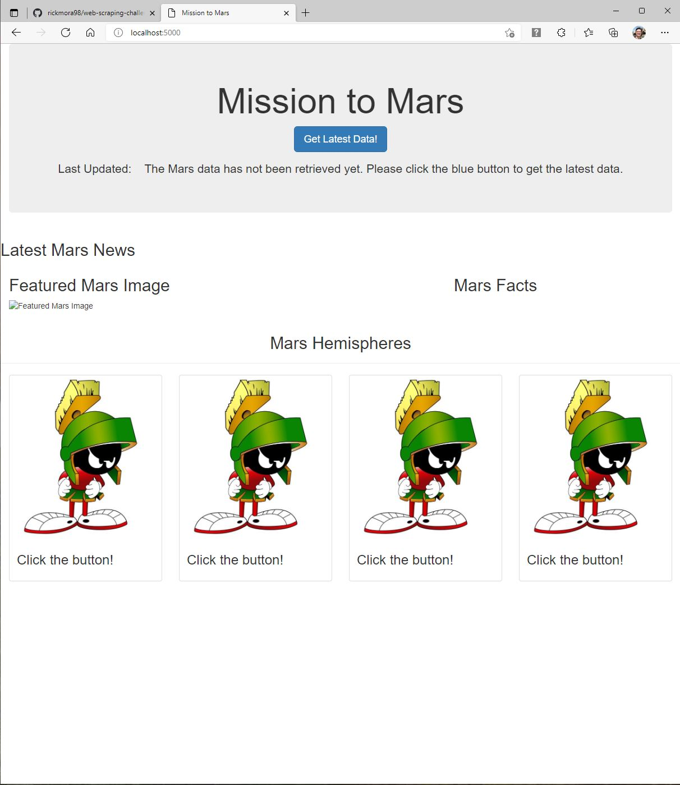
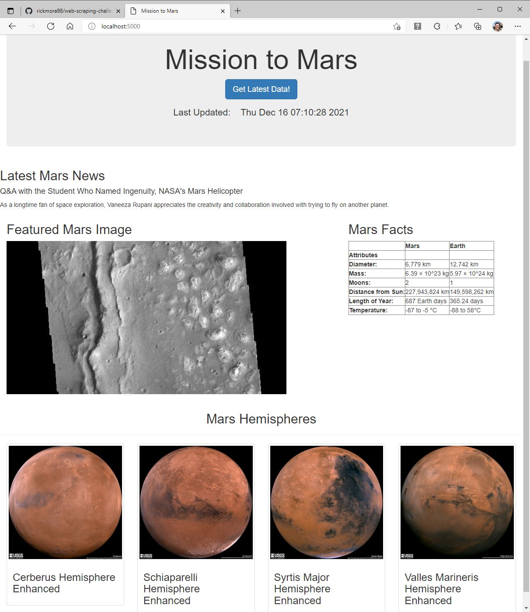

<h1> Mission To Mars!  
(How to use Splinter, BeautifulSoup, Flask, and MongoDB to scrape the Web) </h1>

#### Overview:
This project demonstrates webscraping methods in Python.  It utilizes Splinter and BeautifulSoup to scrape several websites about the planet Mars,
MongoDB to store the scraped text and images, and Flask to display the scraped items to the user's browser.

To run the webscraping program, run *"app.py"*.  
To examine the code files, their locations are indicated in the tree below:

#### Folders/Files:

* **"Code"** (folder)
   * **"static"** (folder)  
      * *"marvin.jpg"* (start-up image used by the flask app)  
   * **"templates"** (folder)  
      * *"index.html"* (template used by the flask app)  
   * *"app.py"* (flask app to demonstrate web scraping)  
   * *"mission_to_mars.ipynb"* (jupyter notebook to explore web scraping)  
   * *"scrape_mars.py"* (contains the web scraping function used by *"app.py"*)  
* **"Images"** (folder)  
   * *"Output_Before_Scraping.JPG"* (image of flask app output)  
   * *"Output_After_Scraping.JPG"* (image of flask app output)  

#### Note:  

+ "mission_to_mars.ipynb" can be run inside a Jupyter Notebook by itself. It might require PIP installing some of the libraries.  
+ Prior to running "app.py", please open your browser to localhost:5000 and also open MongoDB. Also, you don't need to use Chrome, but you must have it installed. 
+ Websites sometimes make changes that require re-writing the webscraping code.

#### Websites Scraped:
https://redplanetscience.com/  
https://spaceimages-mars.com/  
https://galaxyfacts-mars.com/  
https://marshemispheres.com/  

#### Flask Output Before Scraping:
  

#### Flask Output After Clicking the Scrape Button:
   
